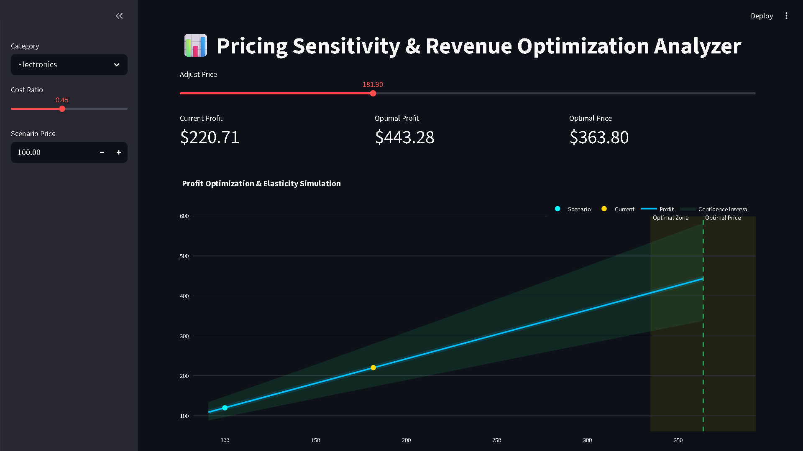
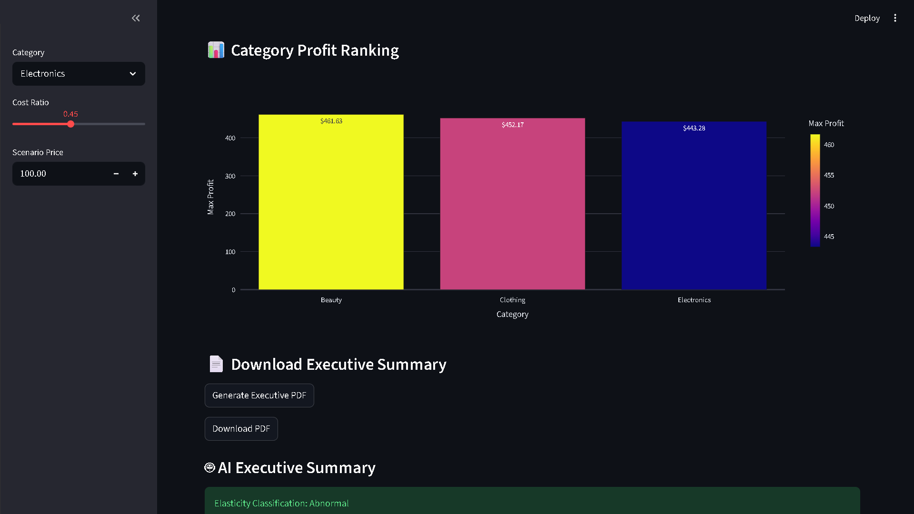
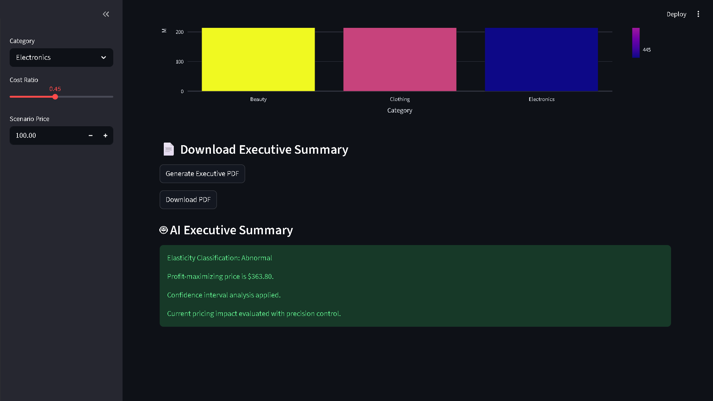

# 📊 Pricing Sensitivity & Revenue Optimization Analyzer

### Revenue Intelligence • Price Elasticity Analytics • Profit Optimization • Executive Pricing Strategy

---

<div align="center">



<br/>
<i>Enterprise Pricing Intelligence Platform for Revenue Optimization, Elasticity Modeling & Strategic Pricing Analytics</i>

<br/>


</div>

---

# 🖼️ Project Overview

An enterprise-style pricing intelligence and revenue optimization platform designed to simulate real-world pricing strategy workflows using:

- elasticity intelligence modeling
- profit optimization simulation
- pricing sensitivity analysis
- scenario-based revenue forecasting
- executive pricing recommendations
- dynamic pricing analytics
- confidence-aware pricing optimization

This project focuses on:
- revenue intelligence
- price elasticity analytics
- profit maximization
- pricing strategy simulation
- scenario analysis
- pricing optimization workflows
- business intelligence dashboards
- strategic pricing recommendations

Built using:
- Streamlit
- Scikit-learn
- Statsmodels
- Pandas & NumPy
- Plotly
- ReportLab

---

# 📊 Dataset Used

## Retail Sales Pricing Dataset

Source: Simulated retail sales pricing dataset for elasticity and revenue optimization analysis.

### Dataset Details

| Attribute          | Details                        |
|--------------------|--------------------------------|
| Categories         | Beauty, Clothing, Electronics  |
| Key Variables      | Price, Demand, Revenue, Profit |
| Business Objective | Profit Optimization            |
| Analytics Focus    | Pricing Intelligence           |
| Optimization Goal  | Revenue Maximization           |

This dataset was used to simulate:
- real-world pricing strategies
- category-level revenue optimization
- elasticity behavior
- pricing sensitivity analysis
- executive pricing decisions

---

# 💼 Business Capabilities

- Price elasticity intelligence
- Profit optimization simulation
- Revenue sensitivity analysis
- Dynamic pricing strategy analytics
- Executive pricing recommendations
- Scenario-based revenue forecasting
- Category-level profit intelligence
- Confidence-aware pricing optimization

---

# 🚀 Key Business Features

| Module                            | Function                                  |
|-----------------------------------|-------------------------------------------|
| 📈 Pricing Optimization Dashboard | Revenue & pricing KPIs                    |
| 💰 Profit Simulation Engine       | Elasticity-based optimization             |
| 📊 Category Profit Ranking        | Profitability comparison                  |
| 🧠 AI Executive Summary           | Pricing recommendations                   |
| 📄 Executive PDF Reports          | Downloadable pricing insights             |
| 🎯 Scenario Simulation            | Dynamic pricing experimentation           |
| 🌐 Streamlit Dashboard            | Interactive pricing intelligence platform |

---

# 📸 Dashboard Preview

## ⭐ Pricing Optimization Dashboard

<div align="center">
  
</div>

---

## ⭐ Profit Optimization & Elasticity Simulation

<div align="center">
  
</div>

---

## ⭐ Category Profit Ranking & Executive Insights

<div align="center">
  
</div>

---

# 💼 Business Problem

Organizations often struggle to:

- identify optimal pricing strategies
- balance revenue and demand sensitivity
- maximize profitability across categories
- simulate pricing scenarios dynamically
- understand elasticity behavior
- optimize profit margins
- make data-driven pricing decisions

Without pricing intelligence systems, businesses may face:
- poor pricing decisions
- reduced profitability
- demand volatility
- inefficient pricing strategies
- revenue leakage
- weak market competitiveness

This platform demonstrates how pricing analytics and elasticity intelligence can support:
- strategic pricing decisions
- revenue optimization
- dynamic pricing simulation
- category-level profitability analysis
- executive pricing intelligence

---

# 📈 Revenue Intelligence Insights

The analysis revealed several strategic pricing insights:

### 🔹 Elasticity modeling improved pricing visibility

Elasticity analytics identified how pricing changes influenced demand behavior and profitability.

### 🔹 Profit optimization simulations identified revenue-maximizing pricing zones across product categories.

The platform identified pricing ranges that maximize profitability while maintaining demand stability.

### 🔹 Category-level intelligence improved strategic pricing

Different product categories demonstrated varying elasticity behavior and profit potential.

### 🔹 Confidence-aware simulations improved decision quality

Confidence interval analysis helped evaluate pricing risk and optimization uncertainty.

### 🔹 Executive summaries improved pricing communication

AI-powered executive summaries enhanced strategic reporting and pricing recommendation workflows.

These insights support:
- revenue optimization
- pricing intelligence
- business strategy analytics
- profitability management
- executive decision intelligence

---

# 🏗️ System Architecture

```text
Retail Sales Data
        ↓
Data Preprocessing
        ↓
Feature Engineering
        ↓
Elasticity Intelligence Modeling
(Log-Log Regression)
        ↓
Profit Optimization Simulation
        ↓
Revenue Sensitivity Analysis
        ↓
Scenario-Based Pricing Engine
        ↓
Executive Pricing Intelligence
        ↓
Interactive Streamlit Dashboard
```

---

# 📁 Project Structure

```text
Pricing-Sensitivity-Revenue-Optimization-Analyzer/
│
├── screenshots/
│   ├── dashboard_overview.png
│   ├── profit_optimization_curve.png
│   └── category_profit_ranking.png
│
├── dashboard/
│   └── app.py
│
├── data/
│   ├── raw/
│   │   └── retail_sales_dataset.csv
│   │
│   └── processed/
│       ├── cleaned_data.csv
│       ├── engineered_features.csv
│       └── elasticity_summary.csv
│
├── logs/
│
├── models/
│   ├── elasticity_models.pkl
│   ├── elasticity_coefficients.csv
│   └── model_metrics.json
│
├── outputs/
│   ├── reports/
│   │   ├── Beauty_pricing_executive_report.pdf
│   │   ├── Clothing_pricing_executive_report.pdf
│   │   └── Electronics_pricing_executive_report.pdf
│   │
│   ├── visuals/
│   │   ├── profit_optimization_chart.png
│   │   └── profit_optimization_chart.html
│   │
│   └── elasticity_summary.csv
│
├── src/
│   ├── main.py
│   ├── config/
│   │   ├── base_config.py
│   │   ├── dev_config.py
│   │   └── prod_config.py
│   │
│   ├── data_pipeline/
│   │   ├── preprocess.py
│   │   └── feature_engineering.py
│   │
│   ├── model_training/
│   │   ├── train_elasticity.py
│   │   └── model_registry.py
│   │
│   ├── services/
│   │   ├── simulation_service.py
│   │   └── pricing_service.py
│   │
│   └── utils/
│       └── logger.py
│
├── requirements.txt
├── README.md
├── .gitignore
└── LICENSE
```

---

# ⚙️ Installation & Setup

## 1️⃣ Clone Repository

```bash
git clone https://github.com/girishshenoy16/Pricing-Sensitivity-Revenue-Optimization-Analyzer.git
cd Pricing-Sensitivity-Revenue-Optimization-Analyzer
```

---

## 2️⃣ Create Virtual Environment

### Windows

```bash
python -m venv venv
venv\Scripts\activate
```

### Mac/Linux

```bash
python3 -m venv venv
source venv/bin/activate
```

---

## 3️⃣ Install Dependencies

```bash
pip install -r requirements.txt
```

---

# ▶️ Running the Revenue Intelligence Pipeline

Run the complete pricing intelligence workflow:

```bash
python src/main.py
```

This automatically performs:
- preprocessing
- feature engineering
- elasticity modeling
- pricing simulations
- revenue optimization
- executive summary generation
- pricing intelligence analytics

---

# 📈 Launch Pricing Intelligence Dashboard

```bash
streamlit run dashboard/app.py
```

Dashboard includes:
- pricing optimization KPIs
- elasticity simulations
- category profit rankings
- executive pricing summaries
- scenario analysis
- downloadable PDF reports

---

# 📂 Automatically Generated Outputs

## 📌 Executive Reports

Saved inside:

```bash
outputs/reports/
```

Automatically generated:
- Beauty pricing executive report
- Clothing pricing executive report
- Electronics pricing executive report

---

## 📌 Optimization Visuals

Saved inside:

```bash
outputs/visuals/
```

Generated assets:
- profit optimization charts
- elasticity simulation visuals
- interactive HTML analytics

---

# 🧠 Analytics Techniques Used

| Technique                    | Purpose                    |
|------------------------------|----------------------------|
| Log-Log Regression           | Price elasticity modeling  |
| Scenario Simulation          | Dynamic pricing analysis   |
| Revenue Sensitivity Analysis | Pricing impact measurement |
| Profit Optimization          | Revenue maximization       |
| Confidence Interval Analysis | Risk-aware optimization    |

---

# 🛠️ Tech Stack

| Category            | Technologies                             |
|---------------------|------------------------------------------|
| Language            | Python 3.10+                             |
| Data Analysis       | Pandas, NumPy                            |
| Analytics           | Statsmodels, Scikit-learn                |
| Visualization       | Plotly, Matplotlib                       |
| Dashboard/UI        | Streamlit                                |
| Reporting           | ReportLab                                |
| Intelligence Domain | Revenue Analytics & Pricing Intelligence |

---

# 🔮 Future Improvements

- Real-time pricing optimization
- Dynamic competitor pricing integration
- Reinforcement learning pricing engine
- Cloud deployment
- API-based pricing recommendations
- Automated pricing experimentation
- Demand forecasting integration
- Multi-market pricing intelligence

---

# 🤝 Contribution

Contributions, suggestions, and improvements are welcome.

If you found this project valuable, consider starring the repository.

---

<div align="center">

### ⚡ Revenue Intelligence & Pricing Optimization for Strategic Business Decisions

</div>